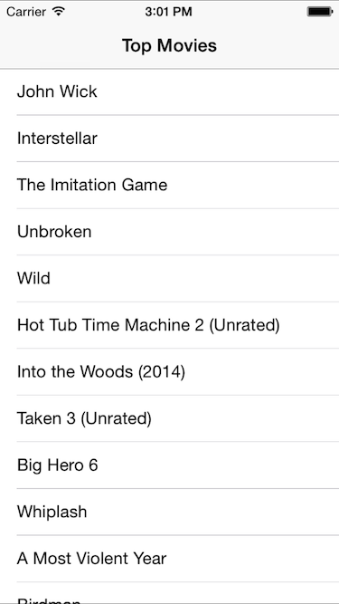

SwiftTopMovies
==============

A Swift app to list the top movies from the iTunes RSS feed. UITableView, NSURLSession, NSJSONSerialization, closures, optionals, and fun. :)

Learn how to build it in the Beginning Swift course: [http://roadfiresoftware.com/learn-swift/](http://roadfiresoftware.com/learn-swift/)
